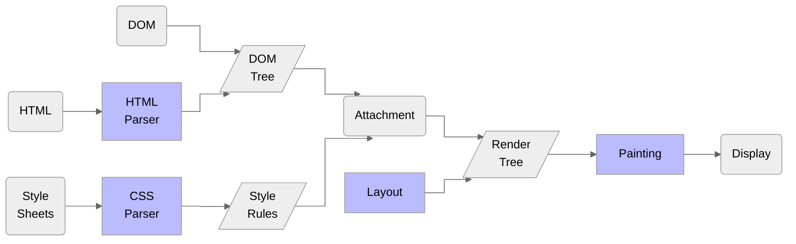

# Optimization

## 사이트 최적화 기본

- inline 스타일을 사용하지 않는다.
- HTML 의 Tree depth 를 깊게 짜지 않는다.
- CSS selector 를 짧게 사용한다.
- Render Tree 생성 이후 박스 모델을 불필요하게 변경하지 않는다.
- 애니메이션이 있는 요소는 `position: fixed | absolute`, `transform`, `opacity` 를 사용하고 `will-change` 를 지정한다.
- JS 로 스타일을 변경할 때는 `display:none` 으로 숨긴 후 변경, 노출한다.
- JS 는 `</body>` 바로 앞에 작성하거나, `defer` 옵션을 사용한다.

## CSS property

- `will-change`: 애니메이션 사용 시 바뀌게 될 속성을 지정  
  브라우저가 준비할 수 있어(GPU에 미리 할당) 애니메이션이 좀 더 부드럽게 적용된다.
- `transition-property`: transition 을 적용할 속성 지정  
  transition 을 모든 속성에 적용하면 각 layer 를 전부 준비하므로 성능에 좋지 않다.



- HTML Parser: 적절한 태그 사용
- CSS Parser: 복잡하지 않도록 작성
- Layout: _Reflow_ 최소화
- Painting: _Repaint_ 최소화

- 웹페이지가 느려지는 원인인 Repaint 와 Reflow 를 최소화하는 것이 중요
- [CSS Triggers](https://www.lmame-geek.com/css-triggers/): CSS 속성별 Layout, Paint, Composite 발생 여부 확인

## Reflow

- 화면의 레이아웃이 변화되었을 때
- DOM 노드의 추가, 제거, 위치, 박스 모델의 변경
- CSS3 애니메이션과 트랜지션
- Font, Text 내용 변경
- 이미지 크기 변경
- `offset`, `scrollTop`, `scrollLeft` 등 계산된 스타일 정보 요청
- 페이지 초기 렌더링
- 윈도우 리사이징

## Repaint

- 화면의 디자인이 변화되었을 때
- `opacity`, `background-color`, `visibility`, `outline` 등 디자인 관련 스타일 변경

## 사이트 최적화 전략

### preload

- 현재 페이지에서 사용할 소스를 미리 로딩

```html
<link rel="preload" as="script" href="preload.js" />
<link rel="preload" as="style" href="preload.css" />
<link rel="preload" as="document" href="preload.html" />
<link rel="preload" as="image" href="preload.png" />
<link
  rel="preload"
  as="font"
  crossorigin
  type="font/woff2"
  href="myfont.woff2"
/>
```

- 현재 페이지에서 3초 이내에 반드시 사용되는 리소스에만 사용한다.
- 남발하면 request 를 늘리므로 오히려 악영향을 주게 된다.

### preconnect

- 현재 페이지에서 사용할 외부 도메인을 브라우저가 미리 준비

```html
<link rel="preconnect" href="https://fonts.googleapis.com" />
```

- 실제 소스의 `<link>` 이전에 별도 작성한다.
- CPU 에 부하를 줄 수 있다. 특히 HTTPS 인 경우 더 많은 부하를 준다.
- 사용자가 10초 이상 보지 않는 짧은 내용의 콘텐츠에는 부적절하다.

### prefetch

- 지금 보는 콘텐츠가 아닌 사용자가 다음에 볼 콘텐츠에서 필요한 내용을 미리 로딩

```html
<link rel="prefetch" as="document" href="prefetch.html" />
<link rel="prefetch" as="script" href="prefetch.js" />
<link rel="prefetch" as="style" href="prefetch.css" />
<link rel="prefetch" as="image" href="prefetch.png" />
<link
  rel="prefetch"
  as="font"
  crossorigin
  type="font/woff2"
  href="myfont.woff2"
/>
```

### async

- JS 파일을 병렬 로딩하며 로딩되면 html 파싱을 멈추고 JS 를 먼저 실행 후 파싱을 이어서 진행

```html
<script src="async1.js" async></script>
<script src="async2.js" async></script>
<script src="async3.js" async></script>
```

- DOM에 영향을 주지 않는 JS 파일에 적합하다.  
  (e.g. jquery, Bootstrap 같은 라이브러리)
- 실행 순서를 보장하지 않는다.  
  순서를 보장하려면 자바스크립트로 동적 코드 삽입을 하고 값을 `false` 로 설정한다.  
  (`script.async = false`)

### defer

- 병렬 로딩을 하지만 HTML 파싱이 끝난 후에 실행

```html
<script src="defer.js" defer></script>
```

- `</body>` 앞에 코드를 넣은 것과 같은 기능이지만, 간혹 `<head>` 영역 안에 js 코드를 넣어야 하는 경우 유용하다.
- js 파일의 용량이 크거나, 파싱 후 바로 실행시켜야 하는 경우 사용한다.
